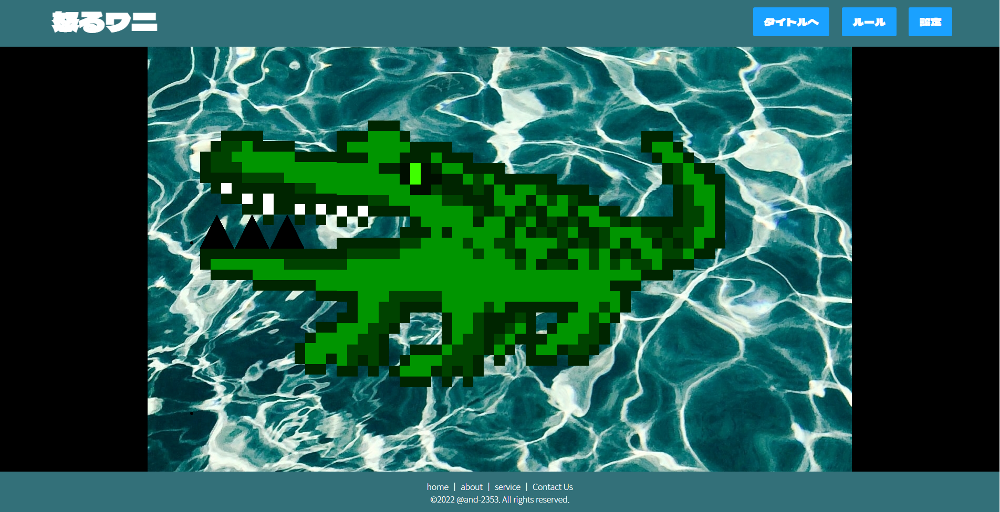

# wani

HTML+CSS/JavaScript で構成

Play：https://and-2353.github.io/wani/

## プレイ画面

<video width="320" height="240" controls>
  <source src="./demo/play_image.mp4" type="video/mp4">
</video>

## 修正点
- GAME CLEAR, GAME OVER 時の処理が地味
- 同じボタン押してもclear_num が加算されるバグがある
- デモ動画(mp4)をとったけど README への記載方法がわからず画像のみ掲載してある

